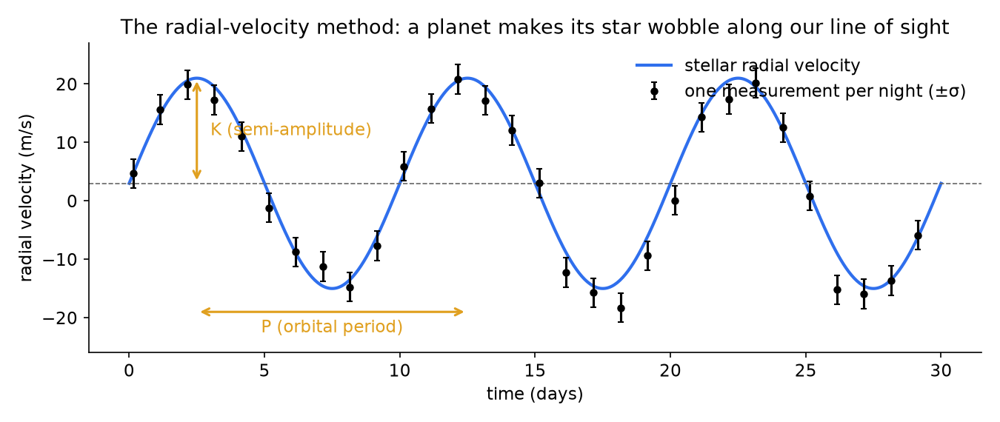
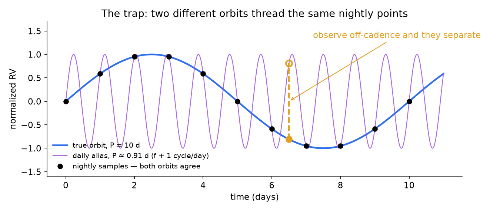
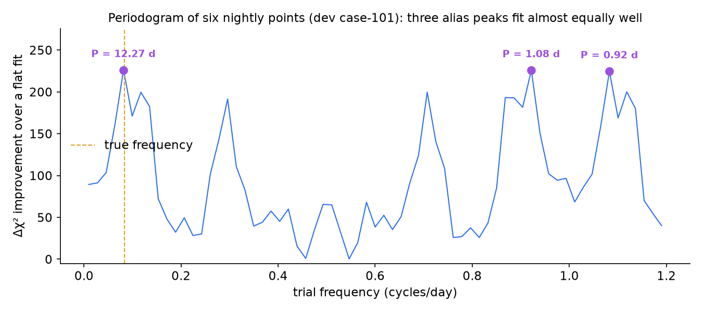

# AliasBreaker — an agent that decides *when to look*, to break orbital-period aliases in exoplanet radial-velocity data

**When a star's nightly velocity measurements fit several candidate orbits
equally well (the aliasing trap), AliasBreaker allocates the scarce follow-up
telescope nights that tell them apart — and it is built as a reference
implementation of evaluation-first agent development.**

The physics is real. The point is the method: a fair baseline, a scripted
ablation, an LLM agent that cannot grade itself, fail-closed trace gates,
tamper-detecting replay, and a frozen evaluation — every claim traceable to a
committed artifact and reproducible offline in minutes. Built in a 72-hour
sprint by one person with Claude Code (orchestrator and agent runtime) and
Codex (independent reviewer); see [how it actually went](docs/narrative.md)
and the [playbook](docs/playbook.md) distilled from it.

> **Synthetic benchmark — decision support only.** All data is generated
> from a real Keplerian physics model; no real telescope data is used and no
> real observations are scheduled.

## The science, briefly

**How a planet is "seen" without being seen.** A star and its planet orbit
their common center of mass, so the star itself moves in a small circle. When
it moves toward us its light is blue-shifted; away, red-shifted. Spectrographs
measure that Doppler shift as a velocity — the star's *radial velocity* (RV)
— to a precision of a few meters per second, night after night. A planet
shows up as a sinusoid in those measurements: its **period P** is the orbital
period, its **semi-amplitude K** scales with the planet's mass (Jupiter moves
the Sun by ~12 m/s; Earth by ~0.09 m/s), and the phase fixes where the planet
is in its orbit. Fix P, and fitting K, phase, and the star's mean velocity is
a linear least-squares problem — which is why astronomers scan P on a grid.



**The trap: aliasing.** Telescopes on Earth observe roughly once per night,
so the sampling has a rhythm of exactly one cycle per day. Any signal at
frequency *f* is then indistinguishable at the sample times from signals at
*f* ± 1, *f* ± 2 … cycles per day — the *daily aliases*. A slow orbit and a
fast alias thread the very same nightly points; only an observation
off-cadence (or a well-chosen later night) separates them. Published planets
have been retracted over exactly this failure (Dawson & Fabrycky 2010,
ApJ 722, 937, "Radial Velocity Planets De-aliased").



**What astronomers do.** Collect sparse epochs → compute a *periodogram*
(fit a sinusoid at every trial frequency; the best fits are the candidate
periods) → discover that several alias peaks are nearly equal → apply for
scarce follow-up telescope time → schedule extra epochs, often by rule of
thumb or evenly spaced → refit and hope the aliases separate. The periodogram
below is computed by this repository's own code from six nightly points of a
real fixture; three candidates fit almost equally well.



## The problem

Follow-up nights are scarce, allocated in small budgets, and scheduled in
advance; availability is patchy; and time only moves forward — a night you
skip is gone. Each additional visit should be chosen to maximally
discriminate the *surviving* candidates given everything measured so far.
That is a sequential planning problem under a budget, and it is exactly the
kind of decision an agent can either make well or make confidently wrong.

## The approach

**A world with ground truth by construction.** Circular-orbit RV signals
with realistic parameters (P 3–20 d, K 8–30 m/s, σ 2–5 m/s), white Gaussian
noise, realized measurements stored per slot in committed fixtures (no
runtime randomness, ~34 KB for the whole final set). Candidate periods come
from a truth-blind periodogram of the initial data. Six observations of
budget across sixty nights of scheduled availability; skipped nights are gone
forever.

**An evaluator that owns the verdict.** After a campaign, every candidate is
refit on all acquired data; the campaign resolves only if normalized support
≥ θ = 0.997, a threshold calibrated on 120 independent cases. No arm supplies
its own confidence.

**Four arms sharing one world:**

| Arm | Scheduling |
| --- | --- |
| Even spacing | six evenly spread nights (the naive floor) |
| **Batch baseline** | a joint χ²-shaped six-night design committed upfront — the strongest of eight scoring variants we swept, on purpose |
| Scripted-adaptive | the same scoring re-planned after every observation (isolates adaptivity itself) |
| **LLM agent** | a Claude Sonnet 5 session in a permission-locked Claude Code project whose only tool is a five-command World CLI; it decides observe/skip/stop night by night and writes a rationale for every choice |

**Gates instead of trust.** Every LLM run must pass a trace auditor (any
tool call outside the declared grammar disqualifies), an audit replay
(actions re-executed against hashed fixtures; measurements and verdict
recomputed; tampering detected), and a model-identity check — or it scores
as noncompletion. The evaluation set was generated from fresh seeds only
after a pushed selection-lock commit; the freeze is tag `freeze-v1`.

## Results

Frozen set: 12 cases in 5 strata (ordinary, crowded, misleading-observation,
constructed scarce-window, unresolvable); 3 LLM replicates per case; all 36
sessions audit- and replay-clean. Detail: `evaluation/final-analysis.json`.

**Correct-resolution rate on the 10 resolvable cases**

| Arm | Correct | Mean obs |
| --- | ---: | ---: |
| Batch baseline | 20% | 5.5 |
| Even spacing | 40% | 5.4 |
| Scripted-adaptive | 40% | 3.8 |
| **LLM agent** | **76.7%** | **4.9** |

Paired LLM−batch difference **+0.57**, two-stage case-clustered bootstrap 95%
interval **[0.30, 0.83]** (n=10; descriptive, no significance claim).

| Stratum | LLM wins / 6 | Batch / 2 | What it shows |
| --- | ---: | ---: | --- |
| Misleading observation | 6 | 0 | confirmation-before-commitment defeats the planted trap |
| Scarce window (reservation) | 5 | 1 | the agent reserves late discriminating nights |
| Ordinary | 10/12 | 1/4 | |
| Crowded | 2 | 0 | hard for everyone |

**The negative result.** On the two *unresolvable* cases — true period not
among the candidates — the agent falsely resolved a wrong candidate in **all
six runs**, while the scripted-adaptive arm abstained every time. Its
superior evidence-gathering drove a wrong answer decisively past the
threshold. We call it *menu-incompleteness amplification*: relative
confidence becomes more dangerous as the agent gets better at earning it.
The fix direction — an absolute model-adequacy check with "none of the
above" as a scoreable answer — is the most transferable lesson here
(playbook §12).

**Development ledger** (12 dev cases, single replicate, in-sample): even 4/12
· scripted-adaptive 4/12 · batch 7/12 · LLM prompt v1 9/12 · LLM prompt v2
11/12. Each step is a journal row with its artifact.

## How it was built

- **Ideation by adversarial convergence** — six real-data ideas killed by an
  independent critique; a blind second round in which two different models
  proposed the same direction. `docs/process/`.
- **Gated development** — plan-gate, two diff-gates, and a mock-judging pass
  by reviewers with no shared context (verbatim in `docs/process/`); each
  triaged in writing. The mock judge found our baseline picking nights by
  array index; fixing it shrank the margin and made it defensible.
- **Evidence ledger** — every phase closed with an artifact, a journal row,
  and a commit: [`docs/build-journal.md`](docs/build-journal.md), written in
  real time.
- **Removed experiment** — eccentric-orbit fitting: built, measured
  (`evaluation/killtest-results.json`), removed (five effective parameters
  from six points overfit and its χ² plateau misled the planner).
- **Playbook + narrative** — [`docs/playbook.md`](docs/playbook.md),
  [`docs/narrative.md`](docs/narrative.md).

## Demo

Five-minute walkthrough — problem, baseline, one live agent campaign,
results, changelog: https://youtu.be/oVLeWbnmYa0

## Run it

See [`docs/reproduction.md`](docs/reproduction.md). Python 3.12 + pinned
NumPy/matplotlib; the test suite (199 tests), the deterministic arms, all 36
official replays, and the frozen analysis reproduce offline with no API key.
Re-running the agent live needs Claude Code.

```
data/cases/          dev + final fixtures (hidden truth under "hidden")
docs/                charter (the evaluation authority), spec, journal,
                     playbook, narrative, process/ (ideation + reviews)
runtime/             the agent: CLAUDE.md protocol, locked settings,
                     /aliasbreaker skill, runs/ (trajectories + verdicts)
src/aliasbreaker/    world, fitting, evaluator, planners, CLI, replay, report
scripts/             launcher, trace auditor, strata probe
tests/               stdlib unittest incl. leakage and tamper proofs
evaluation/          every result artifact, manifests, calibration, analysis
```

## Provenance and license

Everything here was created during the sprint (Aug 28–31, 2026) by Udit
Mukherjee with Claude Code and Codex; no pre-existing code; 100% synthetic
data; no credentials. Agent trajectories, including failures, are committed
under `runtime/runs/`; before publication, three developer-machine metadata
fields in each transcript's harness init record (local account path,
connected-service names, socket path) were redacted by
`scripts/scrub_transcript_metadata.py` — every tool call and result is
verbatim, and the auditor and replay were re-run afterward. MIT license.
